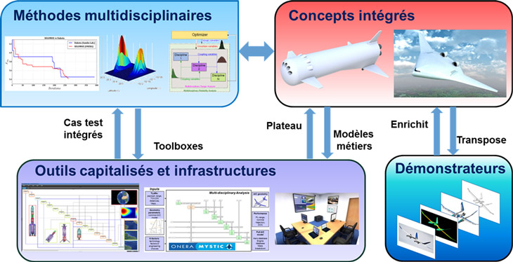

## M2CI-ONERA: Multidisciplinary Methodologies and Integrated Concepts - ONERA The French Aerospace Lab

[M2CI](https://www.onera.fr/dtis/unites-de-recherche#m2ci/) (Multidisciplinary Methodologies and Integrated Concepts) is a research unit at [ONERA](https://www.onera.fr/) dealing with multidisciplinary design analysis and optimization methodologies and its applications to aerospace vehicle design.  

The developped methodologies (optimization algorithms, MDO formulation, surrogate modeling, uncertainty quantification, reliability analysis, etc.) aims to facilitate design space exploration for multidisciplinary systems.

### SMT Toolbox

The surrogate modeling toolbox (SMT) is a Python package that contains a collection of surrogate modeling methods, sampling techniques, and benchmarking functions. It is a collaboration between NASA, MDOLab, ISAE and ONERA. This package provides a library of surrogate models that is simple to use and facilitates the implementation of additional methods. SMT is different from existing surrogate modeling libraries because of its emphasis on derivatives, including training derivatives used for gradient-enhanced modeling, prediction derivatives, and derivatives with respect to the training data. It also includes new surrogate models that are not available elsewhere: kriging by partial-least squares reduction and energy-minimizing spline interpolation. SMT is documented using custom tools for embedding automatically-tested code and dynamically-generated plots to produce high-quality user guides with minimal effort from contributors. SMT is distributed under the New BSD license.

The github for the SMT Toolbox is available [here](https://github.com/SMTorg/SMT) and the associated [documentations](http://smt.readthedocs.io)

### Mixed Continuous Discrete - EGO

This toolbox adresses several variants of the Efficient Global Optimization algorithm for costly constrained problems depending simultaneously on continuous decision variables as well as on quantitative and/or qualitative discrete design parameters. The considered adaptations are based on a redefinition of the Gaussian Process kernel as a product between the standard continuous kernel and a second kernel representing the covariance between the discrete variable values. 

The github for this toolbox is available [here](https://github.com/M2CI-ONERA/M2CI-ONERA.github.io/tree/Mixed-Continuous-Discrete-EGO) 

The paper associated to this toolbox is:

### Deep Gaussian Process - EGO

This toolbox adresses a variant of Efficient Global Optimization (EGO) using Deep Gaussian processes (DGP) to deal with non-stationary functions. Deep Gaussian Processes are a class of surrogate models based on the structure of neural networks, where each layer is a GP. It
considers that the statistical relationship between the inputs and the response is expressed by a functional composition of GPs

The github for this toolbox is available [here](https://github.com/M2CI-ONERA/M2CI-ONERA.github.io/tree/Deep-Gaussian-Process-EGO) 

The paper associated to this toolbox is:

